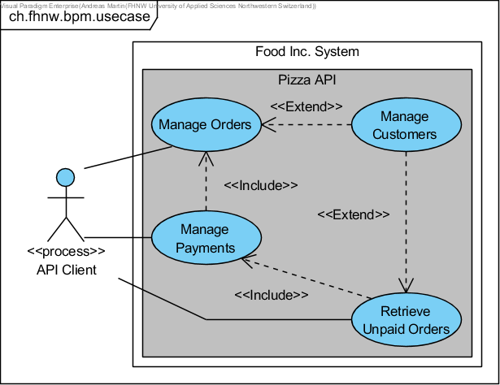
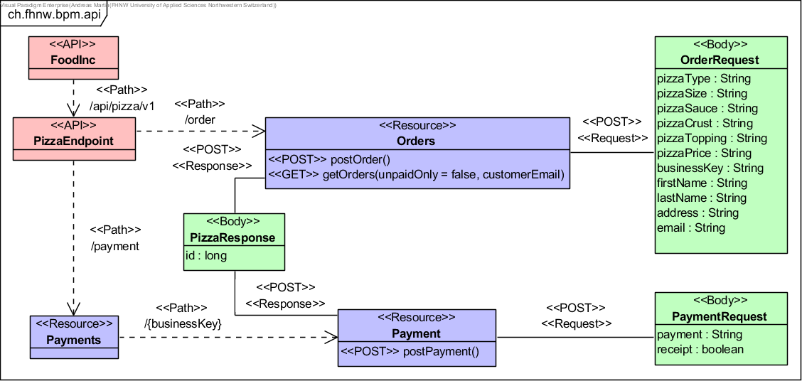
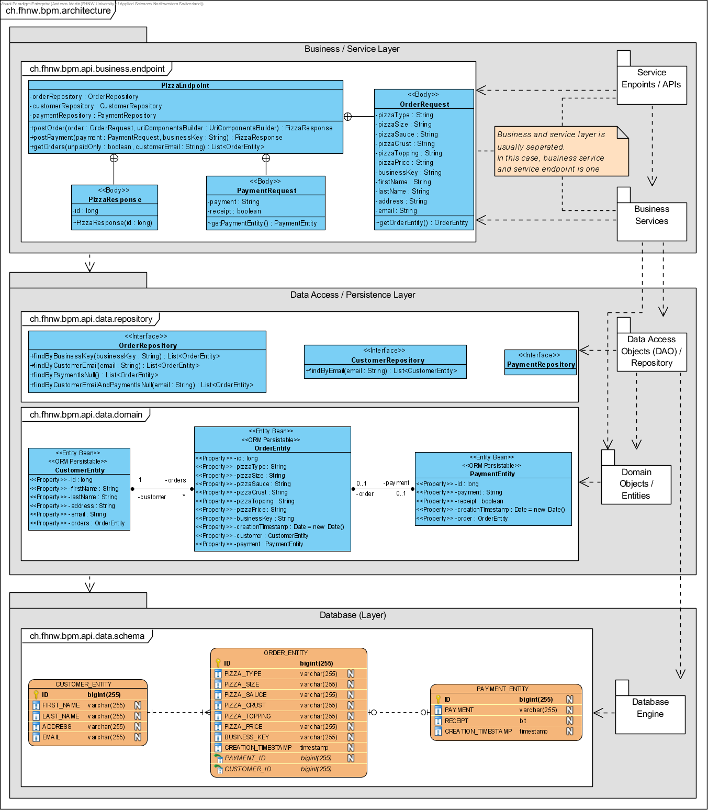
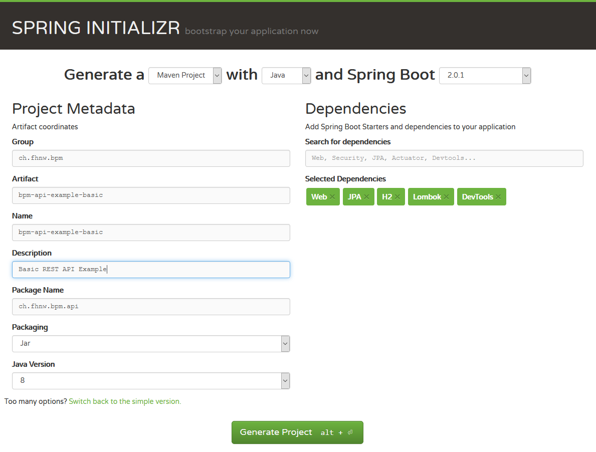

# BPM API Example

This example illustrates how a REST API can be implemented with the help of the Spring framework.

#### Contents:
- [Analysis](#analysis)
- [Design](#design)
    - [API Design](#api-design)
    - [Architecture](#architecture)
- [Application Bootstrapping](#application-bootstrapping)
- [How-to](#how-to)
- [Microservice Application](#microservice-application)
- [Data Access Layer](#data-access-layer)
    - [Domain Objects](#domain-objects)
    - [Repositories](#repositories)
- [Service Layer](#service-layer)
    - [Data Transfer Objects](#data-transfer-objects)
    - [API Implementation](#api-implementation)
    - [API Documentation](#api-documentation)

## Analysis

This exemplary API is part of the Food Inc. system. The API can be used by an external API client, where it can create some orders, manage the payments and retrieve unpaid orders as depicted in the following **UML Use Case** model:



- UC-1 [Manage Orders]: An API client can create and, if not exist, create customer data (UC-4) when an order is placed.
- UC-2 [Manage Payments]: An API client can store payments of an order (UC-1) respectively of a customer (UC-4).
- UC-3 [Retrieve Unpaid Orders]: An API client can retrieve all unpaid orders or unpaid orders of a customer (UC-4).
- UC-4 [Manage Customers]: At this stage, the user management is not accessible from an external actor. However, customer management is required other use cases (UC-1 & UC-3).

## Design

This exemplary microservice as part of the Food Inc. system provides a minimal and basic API as defined in the previous use case model.

### API Design

As depicted in the following image, the API provides very basic methods and is operating with API specific request and response bodies:



### Architecture

For simplification, this API relies on a two-layer architecture comprising business and service layer combined and a data access (sometimes called persistence) layer as depicted in the following diagram. Usually, the business and service layer is separated. And since the database is seldom considered as belonging to the same tier, it is sometimes not disclosed on a layer.



## Application Bootstrapping

This exemplary application is relying on [Spring Boot](https://projects.spring.io/spring-boot), which is the convention-over-configuration solution of the [Spring](https://spring.io) framework for creating stand-alone, production-grade Applications that you can "just run". In detail the application is based on the following:

- [Spring Boot](https://projects.spring.io/spring-boot)
- [Spring Web](https://docs.spring.io/spring/docs/current/spring-framework-reference/web.html)
- [Spring Data](https://projects.spring.io/spring-data)
- [Java Persistence API (JPA)](http://www.oracle.com/technetwork/java/javaee/tech/persistence-jsp-140049.html)
- [H2 Database Engine](https://www.h2database.com)
- [Project Lombok](https://projectlombok.org/)

Please use the Spring Initializr to bootstrap the application on https://start.spring.io based on the following depicted configuration:



Download the ZIP-file and extract it somewhere. Then import the project into your favourite Java/Maven IDE such as IntelliJ, NetBeans or Eclipse.

> In Eclipse use `File > Import > Existing Maven Projects` to import your bootstrapped project.

## How-to

- How to compile your project from Eclipse: `Run > Run As > 3 Maven build` using `clean compile` Maven `Goals`.
- How to run your project from Eclipse: `Run > Run As > Java Application` using `BpmApiExampleBasicApplication` main class.
- How to import packages in Eclipse: `Source > Organize Imports`
- How to generate getters and setters in Eclipse: `Source > Generate Getters and Setters`

## Microservice Application

You may change the `PORT` of the API using the `src/main/java/resources/application.properties` file by adding the following:

```properties
server.port=8081
#spring.datasource.url=jdbc:h2:file:./data/pizza
#spring.datasource.username=sa
#spring.datasource.password=sa
#spring.h2.console.enabled=true
#spring.h2.console.path=/console
```

## Data Access Layer

The data access layer is implemented using [Java Persistence API (JPA)](http://www.oracle.com/technetwork/java/javaee/tech/persistence-jsp-140049.html) and [Spring Data](https://projects.spring.io/spring-data).

### Domain Objects

The [Java Persistence API (JPA)](http://www.oracle.com/technetwork/java/javaee/tech/persistence-jsp-140049.html) is providing the following annotations to realize object relational mapping (ORM):

- `@Entity` tells the entity / ORM framework to consider this class as an entity.
- `@Id` defines an attribute to be a primary key that will be automatically generated by using `@GeneratedValue`.
- `@OneToMany` defines an attribute that represents one-to-many or `@OneToOne` for one-to-one entity relationships, which is maybe `mappedBy` the bi-directional relationship indicted by `@ManyToOne` respectively `@OneToOne`.
- `@Temporal(TemporalType.TIMESTAMP)` defines a temporal attribute, which is in this case of type timestamp.
- `@JsonBackReference` is used to prevent infinite JSON serialisation by a bi-directional relationship.

Create the `ch.fhnw.bpm.api.data.domain` package and in this package the following domain objects including getters and setters:

```Java
@Entity
public class CustomerEntity {
    @Id
    @GeneratedValue
    private long id;
    private String firstName;
    private String lastName;
    private String address;
    private String email;
    @OneToMany(mappedBy = "customer")
    @JsonBackReference
    private List<OrderEntity> orders;
    // getter & setter
}
```

```Java
@Entity
public class OrderEntity {
    @Id
    @GeneratedValue
    private long id;
    private String pizzaType;
    private String pizzaSize;
    private String pizzaSauce;
    private String pizzaCrust;
    private String pizzaTopping;
    private String pizzaPrice;
    private String businessKey;
    @Temporal(TemporalType.TIMESTAMP)
    private Date creationTimestamp = new Date();
    @ManyToOne
    private CustomerEntity customer;
    @OneToOne
    private PaymentEntity payment;
    // getter & setter
}
```

```Java
@Entity
public class PaymentEntity {
    @Id
    @GeneratedValue
    private long id;
    private String payment;
    private boolean receipt;
    @Temporal(TemporalType.TIMESTAMP)
    private Date creationTimestamp = new Date();
    @OneToOne(mappedBy = "payment")
    @JsonBackReference
    private OrderEntity order;
    // getter & setter
}
```

### Repositories

[Spring Data](https://projects.spring.io/spring-data) is providing the following interface, annotations and methods to access the data in CRUD (create, read, update and delete) style:
- `JpaRepository` provides JPA related methods such as CRUD functions.
- `@Repository` tells spring data that it will auto-generate the implementation based on class name provided.
- `@Param` is used before the method param to create a named parameter.
- `findBy...` defines a query from the provided method name extension.

Create the `ch.fhnw.bpm.api.data.repository` package and in this package the following repository interfaces:

```Java
@Repository
public interface CustomerRepository extends JpaRepository<CustomerEntity, Long> {
    List<CustomerEntity> findByEmail(@Param("email") String email);
}
```

```Java
@Repository
public interface OrderRepository extends JpaRepository<OrderEntity, Long> {
    List<OrderEntity> findByBusinessKey(@Param("businessKey") String businessKey);
    List<OrderEntity> findByCustomerEmail(@Param("email") String email);
    List<OrderEntity> findByPaymentIsNull();
    List<OrderEntity> findByCustomerEmailAndPaymentIsNull(@Param("email") String email);
}
```

```Java
@Repository
public interface PaymentRepository extends JpaRepository<PaymentEntity, Long> {}
```

## Service Layer

As mentioned at the beginning, this basic example project combines business and service layer, which provides a better overview but is resulting in a more extended endpoint class.

Create the `ch.fhnw.bpm.api.business.endpoint` package and in this package following `PizzaEndpoint` class:

```Java
@RestController
@RequestMapping(path = "/api/pizza/v1")
public class PizzaEndpoint {
    @Autowired
    private OrderRepository orderRepository;

    @Autowired
    private CustomerRepository customerRepository;

    @Autowired
    private PaymentRepository paymentRepository;

    /* ... */

    @Data private static class OrderRequest { /* ... */ }

    @Data private static class PaymentRequest { /* ... */ }

    @Data private static class PizzaResponse { /* ... */ }
}
```

### Data Transfer Objects

The Data Transfer Object (DTO) is an object that carries data between processes in order to reduce the number of method calls. In this case it is used to define the `POST` body/payload of the `request` and `response`.

To avoid writing boilerplate code such as getters and setters, the [Project Lombok](https://projectlombok.org/) can be used:
- `@Data` is a shortcut for `@ToString`, `@EqualsAndHashCode`, `@Getter` on all fields, and `@Setter` on all non-final fields, and `@RequiredArgsConstructor`.

Create the following **nested** classes as DTOs of `PizzaEndpoint`:

```Java
@Data
private static class PizzaResponse {
    private long id;

    PizzaResponse(long id) {
        this.id = id;
    }
}
```

```Java
@Data
private static class OrderRequest {
    private String pizzaType;
    private String pizzaSize;
    private String pizzaSauce;
    private String pizzaCrust;
    private String pizzaTopping;
    private String pizzaPrice;
    private String businessKey;
    private String firstName;
    private String lastName;
    private String address;
    private String email;

    OrderEntity getOrderEntity() {
        CustomerEntity customerEntity = new CustomerEntity();
        customerEntity.setFirstName(this.firstName);
        customerEntity.setLastName(this.lastName);
        customerEntity.setAddress(this.address);
        customerEntity.setEmail(this.email);
        OrderEntity orderEntity = new OrderEntity();
        orderEntity.setPizzaType(this.pizzaType);
        orderEntity.setPizzaSize(this.pizzaSize);
        orderEntity.setPizzaSauce(this.pizzaSauce);
        orderEntity.setPizzaCrust(this.pizzaCrust);
        orderEntity.setPizzaTopping(this.pizzaTopping);
        orderEntity.setPizzaPrice(this.pizzaPrice);
        orderEntity.setBusinessKey(this.businessKey);
        orderEntity.setCustomer(customerEntity);
        return orderEntity;
    }
}
```

```Java
@Data
private static class PaymentRequest {
    private String payment;
    private boolean receipt;

    PaymentEntity getPaymentEntity() {
        PaymentEntity paymentEntity = new PaymentEntity();
        paymentEntity.setPayment(this.payment);
        paymentEntity.setReceipt(this.receipt);
        return paymentEntity;
    }
}
```

### API Implementation

[Spring Web](https://docs.spring.io/spring/docs/current/spring-framework-reference/web.html) is providing the following annotations to implement REST services:

- `@RestController` annotation identifies a Spring Web REST component.
- `@RequestMapping` defines the basic `path` of a REST API.
- `@GetMapping`, `@PutMapping`, `@PostMapping` and `@DeleteMapping` can be used to define the basic CRUD-style REST verbs and HTTP methods in companion with the corresponding `path` and its resource representation format specified by `consumes` and `produces`.
- `@ResponseStatus` can be used to define the default HTTP response status code.
- `@RequestBody` declares an method parameter to be the body of a request. 
- `@RequestParam` stands for a query parameter that can be added to a requesting path.
- `@PathVariable` declares an method parameter to be the placeholder of a path such as `/api/v1/xyz/{pathVariable}`

Implement the following `POST` an order (`/api/pizza/v1/order`) method including the business logic that a customer will only be created if the email does not already exist:

```Java
@RestController
@RequestMapping(path = "/api/pizza/v1")
public class PizzaEndpoint {
    /* ... */
    @PostMapping(path = "/order", consumes = "application/json", produces = "application/json")
    @ResponseStatus(HttpStatus.CREATED)
    public PizzaResponse postOrder(@RequestBody OrderRequest order) {
        OrderEntity orderEntity = order.getOrderEntity();
        List<CustomerEntity> customerList = customerRepository.findByEmail(orderEntity.getCustomer().getEmail());
        if(!customerList.isEmpty()){
            orderEntity.getCustomer().setId(customerList.get(0).getId());
        }
        orderEntity.setCustomer(customerRepository.save(orderEntity.getCustomer()));
        return new PizzaResponse(orderRepository.save(orderEntity).getId());
    }
    /* ... */
}
```

Then implement the following `GET` all orders (`/api/pizza/v1/order`) or all unpaid orders (`/api/pizza/v1/order?unpaidOnly=true`) or all orders of a customer (`/api/pizza/v1/order?customerEmail=xyz@abc.com`) method:

```Java
@RestController
@RequestMapping(path = "/api/pizza/v1")
public class PizzaEndpoint {
    /* ... */
    @GetMapping(path = "/order", produces = "application/json")
    public List<OrderEntity> getOrders(@RequestParam(defaultValue = "false") boolean unpaidOnly, @RequestParam(required = false) String customerEmail) {
        if(customerEmail != null) {
            if (unpaidOnly)
                return orderRepository.findByCustomerEmailAndPaymentIsNull(customerEmail);
            return orderRepository.findByCustomerEmail(customerEmail);
        }
        if (unpaidOnly)
            return orderRepository.findByPaymentIsNull();
        return orderRepository.findAll();
    }
    /* ... */
}
```

Implement the following `POST` a payment (`/api/pizza/v1/payment/{businessKey}`) method and assign the payment to an order business key:

```Java
@RestController
@RequestMapping(path = "/api/pizza/v1")
public class PizzaEndpoint {
    /* ... */
    @PostMapping(path = "/payment/{businessKey}", consumes = "application/json", produces = "application/json")
    @ResponseStatus(HttpStatus.CREATED)
    public PizzaResponse postPayment(@RequestBody PaymentRequest payment, @PathVariable(value = "businessKey") String businessKey) {
        PaymentEntity paymentEntity = payment.getPaymentEntity();
        paymentEntity = paymentRepository.save(paymentEntity);
        List<OrderEntity> orderList = orderRepository.findByBusinessKey(businessKey);
        if(!orderList.isEmpty()){
            OrderEntity orderEntity = orderList.get(0);
            orderEntity.setPayment(paymentEntity);
            orderRepository.save(orderEntity);
        }
        return new PizzaResponse(paymentEntity.getId());
    }
    /* ... */
}
```

### API Documentation

The [SpringFox](https://springfox.github.io/springfox) project provides an automated JSON API documentation for API's built with Spring based on [Swagger](https://swagger.io) and [Swagger UI](https://swagger.io/swagger-ui)

Add the following dependencies to the maven project `pom.xml` under `dependencies`:

```XML
<dependency>
    <groupId>io.springfox</groupId>
    <artifactId>springfox-swagger2</artifactId>
    <version>2.8.0</version>
</dependency>
<dependency>
    <groupId>io.springfox</groupId>
    <artifactId>springfox-swagger-ui</artifactId>
    <version>2.8.0</version>
</dependency>
```

Then create the following Swagger configuration class in the `ch.fhnw.bpm.api.business.endpoint` package: 

```Java
@Configuration
@EnableSwagger2
public class SwaggerConfig {
    @Bean
    public Docket api() {
        return new Docket(DocumentationType.SWAGGER_2)
                .select()
                .apis(RequestHandlerSelectors.any())
                .paths(PathSelectors.ant("/api/**"))
                .build();
    }
}
```

Once you compiled and booted up the microservice, you can access the Swagger UI under http://localhost:8081/swagger-ui.html or http://localhost:8080/swagger-ui.html if the port has not been changed.